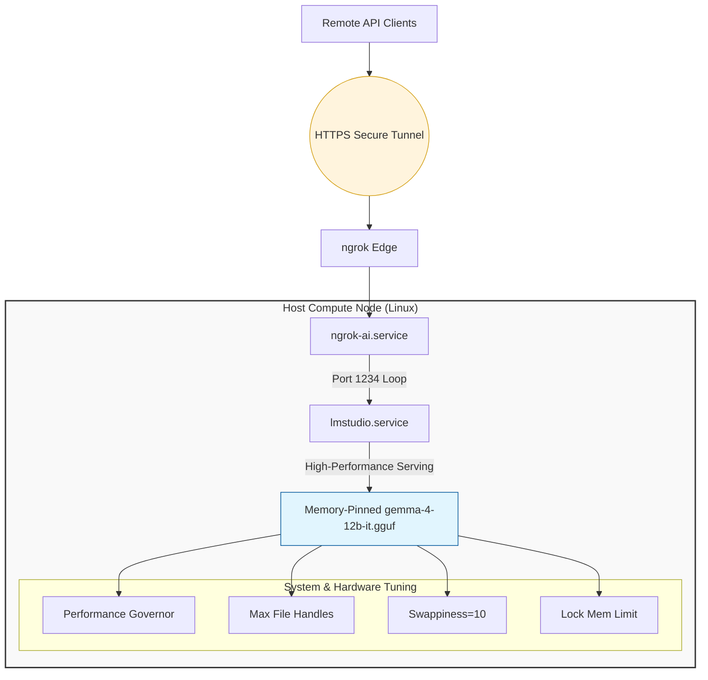

##  Coming soon! A new way to complete local LLM PR Reviews
I've developed a brand new way to use Github runners securely and remotely with your LM Studio installation. I've had great success in using this topology for real world application developement teams, greatly increasing their PR velocity.

### The new version works like this:

-- Install my agent in the source repo
-- my agent runs a custom prompt explaining the rules
-- my agent fetches context (that you specify in the yaml)
-- my agent type is configured via github vars - you control the actual open weights model you want and context sizes
-- my agent finds a free runner from a set of runners that you've configered (super scalable!)


## Previous (now deprecated) veraion
---
LMStudio Headless Server
This repository contains the bootstrap scripts and configuration for running a headless local LLM on a minimal Debian box. It is optimized for high-performance serving using lmstudio.service and ngrok for secure remote access.

### 🏗 Architecture Overview


### 🛠 Service Management (systemd)
Use these commands to control the background processes.

Note: Stopping or restarting lmstudio.service will automatically cascade to the ngrok tunnel because of the explicit dependency rules configured in the bootstrap scripts.

```bash
# Check if the services are running and view active status/recent logs
sudo systemctl status lmstudio.service ngrok-ai.service

# Restart the entire stack (useful if a model locks up or configuration changes)
sudo systemctl restart lmstudio.service ngrok-ai.service

# Stop the services cleanly (frees up RAM and CPU allocation)
sudo systemctl stop lmstudio.service ngrok-ai.service

# Start the services back up
sudo systemctl start lmstudio.service ngrok-ai.service

# View live, scrolling system logs for troubleshooting
sudo journalctl -u lmstudio.service -u ngrok-ai.service -f
```
### 🔗 Endpoint & Tunnel Discovery
Use these to find out where your traffic is routing without logging into the ngrok web dashboard.
```bash
# Retrieve your active, un-truncated public ngrok HTTPS URL
curl -s http://127.0.0.1:4040/api/tunnels | grep -o '"public_url":"[^"]*' | cut -d'"' -f4

# Verify local network socket bindings (Look for port 1234 and 4040)
sudo ss -tulpn | grep -E '1234|4040'
```

#### 🏎️ Hardware & Optimization Checkups
Use these to ensure your Threadripper cores are pinned correctly and track memory footprints.

```bash
# Verify that all CPU cores are actively locked in 'performance' mode
cat /sys/devices/system/cpu/cpu*/cpufreq/scaling_governor | sort | uniq

# Monitor real-time CPU thread consumption and RAM overhead
htop

# Check current virtual memory tracking limits
sysctl vm.max_map_count swappiness

```

### 🧪 Local & Remote API Testing
Run these snippets to execute a swift connectivity check. They use standard OpenAI-compatible body payloads.

Local Loopback Test
Run this directly on the server to bypass ngrok entirely and test the core LM Studio engine:

```bash
curl http://127.0.0.1:1234/v1/chat/completions \
  -H "Content-Type: application/json" \
  -d '{
    "model": "google/gemma-4-12b-it",
    "messages": [{"role": "user", "content": "Ping? Respond with: Pong!"}],
    "temperature": 0.1
  }'
```

### Remote Public Tunnel Test
Run this from an external machine (or your phone via a terminal client) to verify the edge routing:
```bash
curl https://YOUR_SUBDOMAIN_HERE.ngrok-free.app/v1/chat/completions \
  -H "Content-Type: application/json" \
  -d '{
    "model": "google/gemma-4-12b-it",
    "messages": [{"role": "user", "content": "Confirm remote connection."}],
    "temperature": 0.1
  }'
```

### 🔄 How to Switch Your Server to LM Link
Since your headless server is running via the CLI (lms), you can link it directly from the terminal without needing a GUI desktop interface.

Step 1: Pause the ngrok Tunnel
Turn off the ngrok side so it stops broadcasting publicly:
```bash
sudo systemctl stop ngrok-ai.service
sudo systemctl disable ngrok-ai.service
```
(Leave lmstudio.service running, as LM Link still utilizes the core local headless daemon).

## Step 2: Authenticate the CLI
Log into your LM Studio account directly from your server's terminal:
```bash
lms login
```
Follow the on-screen prompts to authenticate your account.

## Step 3: Enable the Link
Turn on the secure mesh networking layer:
```bash
lms link enable
```

## Step 4: Connect Your Remote Client
1. Open LM Studio on your remote computer or phone (using the Locally app).
2. Log into the same LM Studio account.
3. Go to the LM Link tab or settings menu and toggle it on.

Your server’s hardware is now securely bound to your remote devices. When you open the model selection drop-down on your laptop, google/gemma-4-12b-it will be sitting right there, ready to offload the heavy processing to your server with zero firewall configuration.

### 👾 The Bootstrap Scripts
View the original setup scripts here *this is where you are now!* :
https://github.com/vinas1/LMStudio/blob/main/README.md
